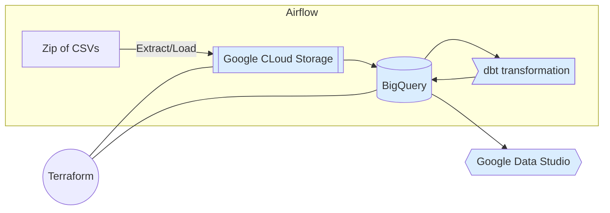

# F1 analyze project
This repo contains the work carried out as result project for the course DE Zoomcamp. This course is conducted by Alexey Grigorev. You can take the course at any time and it is free. Links to course - https://github.com/DataTalksClub/data-engineering-zoomcamp

## Table of Contents
1. About the Project
2. Key files and folders explained
3. Work explained
4. Virtual environment
5. Deployment
6. Pipeline start

## 1. About the Project
The project was created to analyze the results of Formula 1 teams and identify unbalanced ("self-carrier") cars.
At the moment, it is the quality of development and tuning of the car that is the main reason for scoring points, the skill of the pilots is increasingly receding into the background.
And unbalanced cars can lead to dominance of one of the teams and boring competitions.
Using the developed dashboard, you can analyze the points advantages of teams.
The result dashboard - https://datastudio.google.com/reporting/7db3003e-abbd-4a55-b786-e09f6a558e62 (https://datastudio.google.com/s/hC_P69amgN8)

## 2. Key files and folders explained
* airflow - folder with Apache Airflow components  
* models - folder with dbt models  
* terraform - folder with terraform components  
* readme.md - project readme file  
* dbt_project.yml - dbt config project file  

## 3. Work explained
### Architecture

## 4. Virtual environment

To run project you need:
1. Create GCP environment
* create GCP project (zoomcampproject - used in other components by default project id)
* create service account with permissions to operate with Google Cloud Storage and BigQuery
2. Install terraform
3. Install Docker and Docker-compose

## 5. Deployment

To deploy project you need:
1. From terraform foler plan and apply environment in GCP (you need to enter your project ID (zoomcamproject by default)
2. Create dbt environment
3. Build docker-compose in airflow folder

## 6. Pipeline start

To start you need raise docker-compose from Airflow and start data_ingestion_gcs dag

## 7. Visualisation

The result dashboard - https://datastudio.google.com/reporting/7db3003e-abbd-4a55-b786-e09f6a558e62 (https://datastudio.google.com/s/hC_P69amgN8)

For each Formula 1 season, the share of dominance of the first team over the second in points was calculated.
The dashboard contains two tiles:
1) Pie chart with the distribution of the number of seasons won by teams with more than 25% dominance in points from the second team
2) A grafic chart showing the winning teams by season and the proportion of their dominance over the second team
The dashboard also contains a drill down list to display information only on the selected command.

On the chart, you can analyze the seasons won by one team, taking into account the share of dominance in points from the second team.
Looking at the winning streaks, one can see the dominance of the Red Bull and Mercedes teams in 2010-2013 and 2014-2020.
